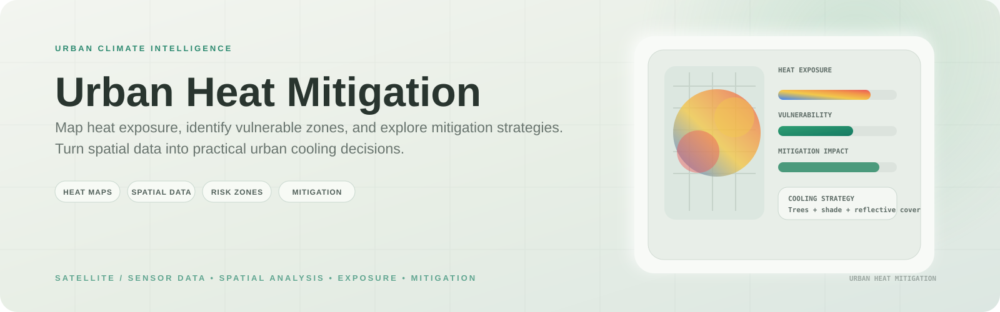
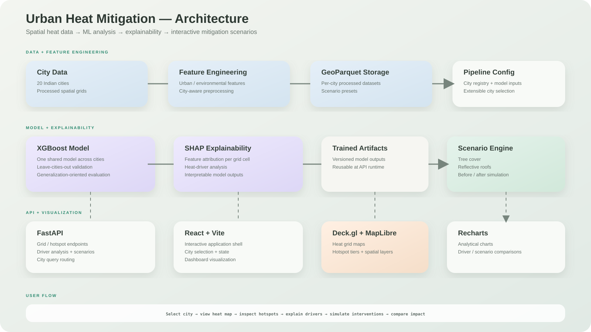

<p align="center">
  
</p>

<h1 align="center">Urban Heat Mitigation</h1>

<p align="center">
  <strong>AI-powered urban heat analysis and cooling-intervention simulation for 20 Indian cities.</strong><br>
  Explore heat exposure, understand its drivers, and evaluate practical mitigation strategies.
</p>

<p align="center">
  <a href="https://urban-heat-mitigation-mu.vercel.app/">Live Demo</a> ·
  <a href="https://urban-heat-api.onrender.com/docs">API Documentation</a>
</p>


## Overview

Urban Heat Mitigation combines geospatial data, machine learning, explainability, and interactive visualization to analyze urban heat patterns across **20 Indian cities**.

A shared **XGBoost model** analyzes grid-level heat drivers, **SHAP** explains model predictions, and a scenario engine simulates cooling interventions such as increased tree cover and reflective roofs.

**Current status:** V1.6 — actively being improved.

## Architecture

<p align="center">
  
</p>

### End-to-end flow

```text
City / spatial data
        ↓
Feature engineering + GeoParquet
        ↓
Shared XGBoost model
        ↓
Heat prediction + SHAP explanations
        ↓
FastAPI
        ↓
React + Deck.gl + MapLibre
        ↓
Heat maps → driver analysis → mitigation scenarios
```

## Core Capabilities

### Heat Mapping
Interactive spatial grids visualize land-surface temperature and hotspot tiers for each supported city.

### Driver Analysis
SHAP-based explanations show which features contribute to heat predictions at the grid-cell level.

### Cooling Scenario Builder
Simulate interventions such as increased tree cover and reflective roofs and compare before/after outcomes.

### Spatial Visualization
Deck.gl and MapLibre provide interactive map rendering, while Recharts supports analytical comparisons.

### Temperature Context
The application distinguishes **land surface temperature (LST)** from air temperature so displayed measurements are interpreted correctly.

## Model & Evaluation

A single shared **XGBoost model** is trained across the supported cities instead of maintaining one independent model per city.

Evaluation uses a **leave-cities-out split**, testing whether the model can generalize to a city it did not see during training rather than measuring performance on a random sample from already-seen cities.

SHAP provides local feature attribution for interpreting heat predictions.

## Tech Stack

| Layer | Technology |
| --- | --- |
| ML | XGBoost, SHAP |
| Geospatial | GeoPandas, GeoParquet |
| Backend | FastAPI, Python |
| Frontend | React, Vite |
| Maps | Deck.gl, MapLibre GL |
| Charts | Recharts |
| Storage | GeoParquet flat files |
| Deployment | Vercel + Render |

## Screenshots

The repository currently does not contain screenshot image assets. Add project screenshots under `docs/screenshots/` and link them here when ready; the README intentionally avoids broken image references.

## Run Locally

The repository includes processed data and trained model artifacts required to run the application locally.

### Backend

```bash
python -m venv venv
```

Windows PowerShell:

```powershell
venv\Scripts\Activate.ps1
```

macOS / Linux:

```bash
source venv/bin/activate
```

Install dependencies and start the API:

```bash
pip install -r requirements.txt
uvicorn api.main:app --reload --port 8000
```

### Frontend

In a second terminal:

```bash
cd frontend
npm install
npm run dev
```

Open `http://localhost:5173` and select a city from the application.

## Project Structure

```text
api/        FastAPI routes for grids, hotspots, drivers and scenarios
pipeline/   Data preparation and feature engineering
models/     XGBoost training, SHAP analysis and model artifacts
data/       Per-city processed grids and scenario presets
frontend/   React + Vite application
```

## API

The backend exposes city-scoped endpoints for the main analysis workflow, including:

- Heat-map grid data
- Hotspot information
- Driver / SHAP analysis
- Cooling scenarios

Each endpoint accepts a city identifier so the same analysis pipeline can serve all supported cities.

Interactive API documentation is available at the deployed FastAPI `/docs` endpoint.

## Deployment

- **Frontend:** Vercel
- **Backend:** Render
- **Data / model artifacts:** repository-hosted flat files and trained artifacts

## License

MIT

---

<p align="center">
  <a href="https://urban-heat-mitigation-mu.vercel.app/">Live Demo</a> ·
  <a href="https://urban-heat-api.onrender.com/docs">API Docs</a>
</p>
